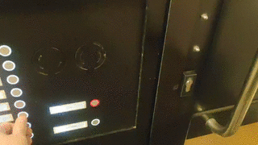

# doorman
Doorman is an ESP8266 based mqtt bridge for TCS door control systems (https://www.tcsag.de/). 

## Main Features
 * Mqtt integration for all messages read from the bus and for writing messages to the bus
 * Button push pattern detection - you can define a pattern and assign a code that is written to the bus if the pattern is detected (Example: automatically open the door if the doorbell is pressed x times in a certain way). A successfully detected pattern is also published via mqtt. 
 * Party mode (When this is enabled, the door opener automatically opens if the door bell is pressed)

## Credits
Doorman is heavily built on the code and the information of the following two projects: 

**TCSIntercomArduino** different methods to read from and write to TCS bus 
Reverse Engineering video: <https://www.youtube.com/watch?v=xFLoauqj9yA&t=11s> 
<https://github.com/atc1441/TCSintercomArduino>

**tcs-monitor** an mqtt monitor for listening to the TCS bus 
Blog Post: <https://blog.syralist.de/posts/smarthome/klingel/> 
<https://github.com/Syralist/tcs-monitor>