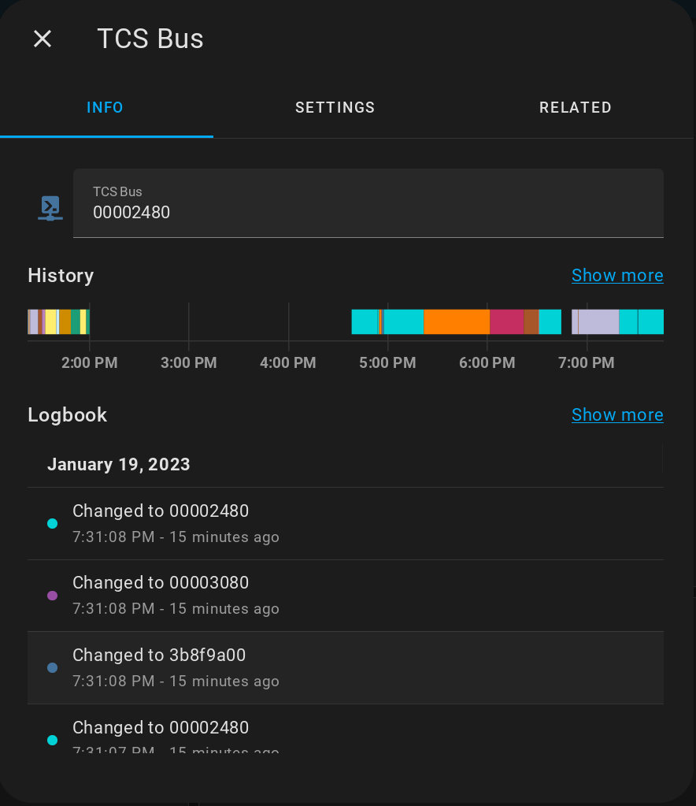
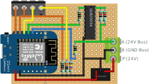

# doorman

Doorman is an ESP8266 based mqtt bridge for TCS door control systems (<https://www.tcsag.de/>).

## Main Features

* Mqtt integration for all messages read from the bus and for writing messages to the bus
* Button push pattern detection - you can define a pattern and assign a code that is written to the bus if the pattern is detected (Example: automatically open the door if the doorbell is pressed x times in a certain way). A successfully detected pattern is also published via mqtt.
* Party mode (When this is enabled, the door opener automatically opens if the door bell is pressed)

### Party Mode

When Party mode is enabled, a code (default: entry door buzzer code) is automatically sent when a certain code has been received on the bus (default: entry door bell code).

This allows you to enable party mode during a party and your guests can just enter by pressing your door bell when they arrive or go for a smoke.

Party mode can be turned on or off by using the switch on in Homeassistant, or by quickly lifting up you handset 3x (if your handset code has been configured correctly).

## How to get Codes

Connect doorman to an mqtt broker by setting up WiFi credentials and mqtt broker.

If you already have Homeassistant configured with the mqtt integration on the same broker, go to Settings -> Devices -> Doorman. You should see a text entity called "TCS Bus". This entity allows to read all messages from the bus and write to the bus. Do the action for the signal you want to get the code of (apartment door bell, entry door bell or lifting up your handset). In the history of the TCS Bus entity you should see all codes that have been read from the bus. Then you can copy the values to the configuration settings in the home assistant device.

The codes that are specific to your flat are the long ones (without 0000 prefix).

## Wiring

If you open your phone in your flat (check TCS website for manuals), you will probably find the following screw terminal lines: A, B, E, P. 

A and B are the bus lines. You have to make sure which one is 24V+ and wire this to A of the setup. The other one is GND. 

The P line can be used for power supply. You can also skip the part and power through the USB port of the Wemos D1. 

### Part list

* 1x Microcontroller 1x (Choose one)
  * Wemos D1 Mini (based on ESP8266, does have single color led) [Buy on Amazon (partner link)](https://amzn.to/3VmqxsN) / [Buy on aliexpress (partner link)](https://s.click.aliexpress.com/e/_Dkct0Yl)
  * Wemos S2 Mini (based on ESP32-S2, does not have led) [Buy on Amazon (partner link)](https://amzn.to/3nkMbRq) / [Buy on aliexpress (partner link)](https://s.click.aliexpress.com/e/_Dnoy8df)
  * Wemos S3 Mini (based on ESP32-S3, does have RGB led)
* 1x ULN2003A (to send commands to the bus) [Buy on Amazon (partner link)](https://amzn.to/48Qoq6i)
* 1x Traco TSR1 2405 (dc/dc 24V to 5V as power supply for Wemos)
* 1x tripple screw terminal (to connect to the bus) [Buy on Amazon (partner link)](https://amzn.to/3OrmcSC)
* 2x double screw terminal (optional, to connect switch and led) [Buy on Amazon (partner link)](https://amzn.to/3OrmcSC)
* 1x 1 MOhm resistor
* 1x 1 kOhm resistor
* 1x 147 kOhm
* 1x 10k Ohm resistor (only needed to wire a button)
* 1x 330 Ohm resistor (only needed to wire a led)
* 2x 1.2 Ohm resistors

## TODO

There are still a view things open.

* Refactor config management, it's a lot of code duplication at the moment
* Maybe allow wifi/mqtt configuration without the need for project compilation

## Credits

Doorman is heavily built on the code and the information of the following two projects:

**TCSIntercomArduino** different methods to read from and write to TCS bus \
Reverse Engineering video: <https://www.youtube.com/watch?v=xFLoauqj9yA&t=11s> \
<https://github.com/atc1441/TCSintercomArduino>

**tcs-monitor** an mqtt monitor for listening to the TCS bus \
Blog Post: <https://blog.syralist.de/posts/smarthome/klingel/> \
<https://github.com/Syralist/tcs-monitor>
